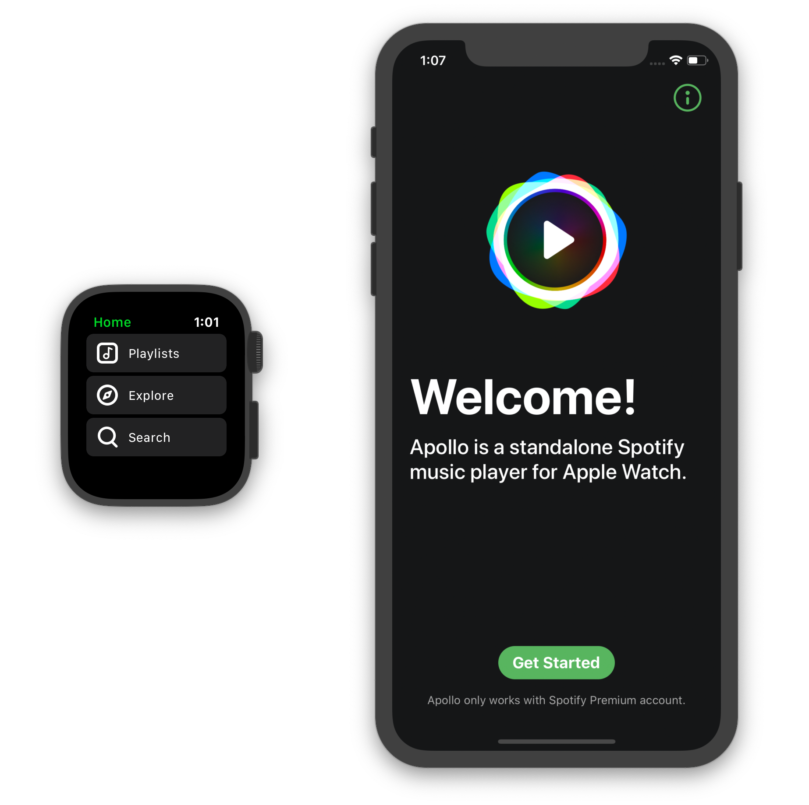

# Apollo

A Spotify player for watchOS.

The goal of open sourcing this project is to motivate Spotify to add playback support to their watchOS app. I'm not planning to offering any support on building/installing the app to your Apple Watch so please avoid opening issue around these topics.

## Setup

1. Figure out an implementation for the [server](Server.md) e.g. [open-apollo-server](https://github.com/lgruen/open-apollo-server)

2. Register an App at https://developer.spotify.com/dashboard/applications
    - Enter your App Bundle ID and App Redirect URI under settings

3. Replace all the placeholders in the project with real information.
    - Go to Apollo/Configuration
    - In `DefaultServiceConfiguration.swift` enter your server endpoints
    - In `SpotifyAuthorizationContext.swift` enter your Spotify Client ID, App URL-Scheme and App Redirect URI

4. Build & Run :)

## Improvements

- [X] New spinner animation while loading
- [X] Invert colors of logout buttons
- [X] Handle error if FileID is not found
- [X] Confirmation popups on local storage deletion
- [X] Update playlists with long press on playlists button
- [X] Add Feedback view for update or deletion
- [ ] Add playlist update for downloads in settings
- [ ] Set audio quality in settings (320/160 kbits)
- [ ] Add cover art in background of audio player
