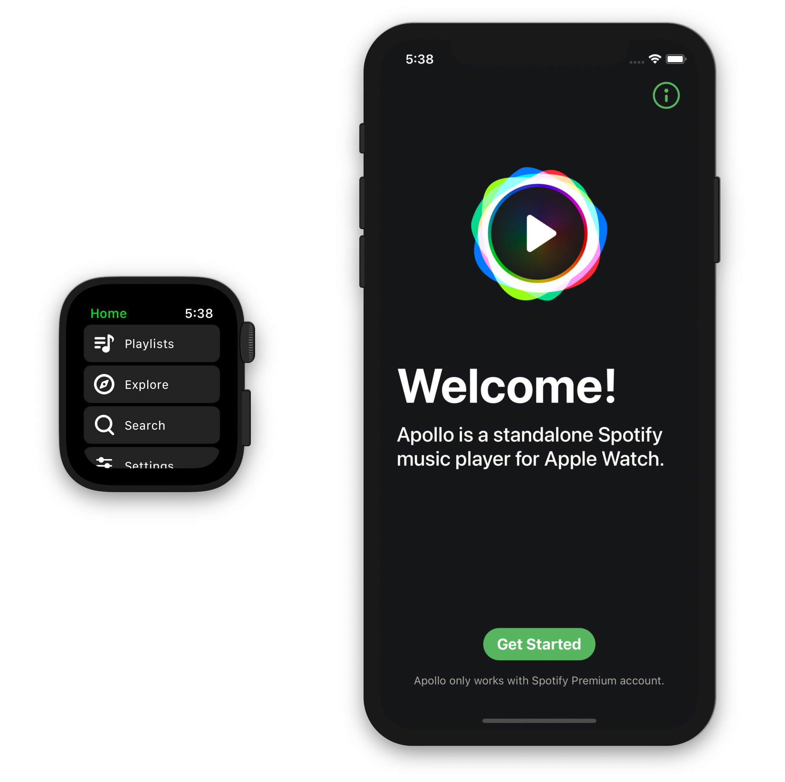

# Apollo

A Spotify player for watchOS with streaming mode and offline playback.

The goal of open sourcing this project by [KhaosT](https://github.com/KhaosT/open-apollo) was to motivate Spotify to add playback support to their watchOS app after being [banned](https://www.iphone-ticker.de/apollo-fuer-apple-watch-spotify-setzt-app-store-ausschluss-durch-133892/) from the AppStore in 2018. Spotify added [streaming-support](https://www.golem.de/news/musik-spotify-funktioniert-auf-der-apple-watch-auch-ohne-iphone-2011-151900.html) to their app in 2020, but support for offline-playback is still missing. As KhaosT is not offering any support or maintenance on this project, there will be only low frequent updates. Please avoid opening issue for support on building/installing the app to your Apple Watch. Any help of contribution to this project is welcome by solving issues from the TODO list below.

Latest App-Version: 1.1.1 (built on iOS: 14.4, watchOS: 7.2)

## Setup

1. Figure out an implementation for the [server](Server.md) e.g. [open-apollo-server](https://github.com/lgruen/open-apollo-server)

2. Register an App at https://developer.spotify.com/dashboard/applications

   - Enter your App Bundle ID and App Redirect URI under settings

3. Replace all the placeholders in the project with real information.

   - Go to Apollo/Configuration
   - In `DefaultServiceConfiguration.swift` enter your server endpoints
   - In `SpotifyAuthorizationContext.swift` enter your Spotify Client ID, App URL-Scheme and App Redirect URI

4. Build & Run :)

## Functions

- Online-Playback (Streaming Mode)
- Offline-Playback (Offline-Mode)
- Explore Playlists, Artists and Tracks
- Search for Playlists, Artists and Tracks
- Configuration options in Settings

## Interaction

- Offline Mode: enable/disable in Settings
- Shuffle Mode: enable/disable in Settings
- Update Playlists: longPress on Playlists
- Download Playlists: longPress on Playlist
- Stop Downloads: longPress on Downloads
- Delete Cache: in Settings -> Local Storage
- Delete Downloads: in Settings -> Local Storage
- Volume: turn Digital Crown while in playback

_Note: Playlists only appear if they are marked as favorite_

## Improvements

### TODO

- [ ] Fix "No Song" error
- [ ] Close or suppress warnings on playback
- [ ] Add option to update downloaded playlists
- [ ] Load more than 50 tracks per playlist
- [ ] Show circular download-progress on Button
- [ ] Set audio quality in settings (320/160 kbits)
- [ ] Add cover art in background of audio player?

### Done

- [x] Add saved tracks (favorites) to playlists
- [x] Fix buttons in download confirmation prompt
- [x] Add playback info in large complication
- [x] Downloads in foreground mode (speed)
- [x] Fix Downloads appearance after completion
- [x] Updated menu icons
- [x] Replacement of Force-Touch (deprecation)
- [x] Update for iOS 14 and watchOS 7
- [x] New spinner animation while loading
- [x] Invert colors of logout buttons
- [x] Handle error if FileID is not found
- [x] Confirmation popups on local storage deletion
- [x] Update playlists with long press on playlists button
- [x] Add Feedback view for update or deletion
- [x] Update for iOS 13 and watchOS 6
